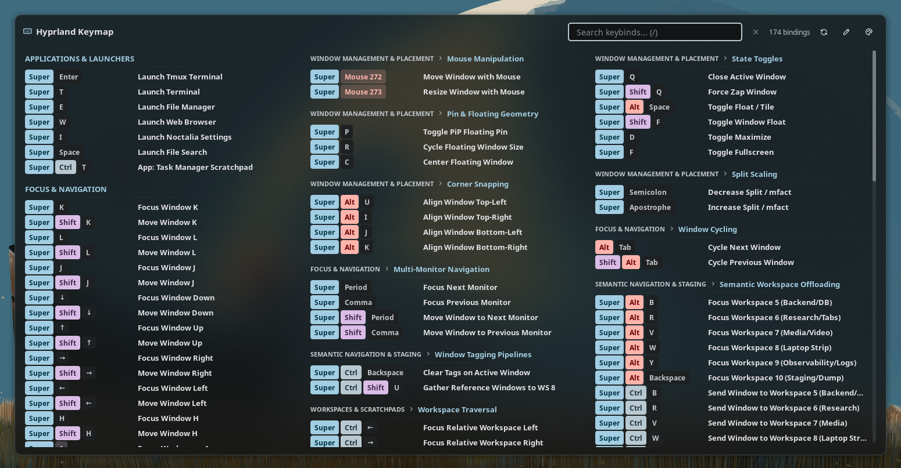
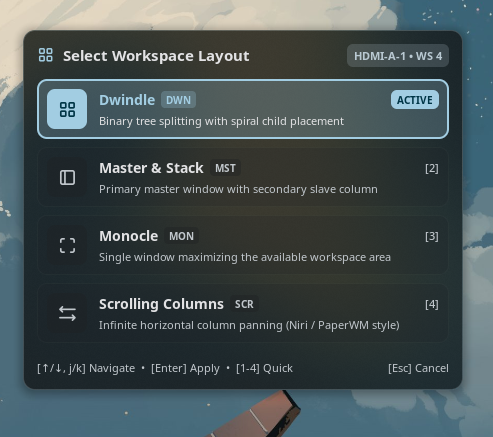
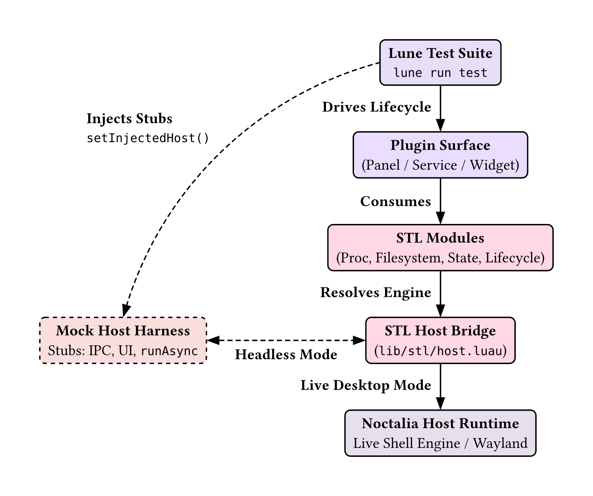
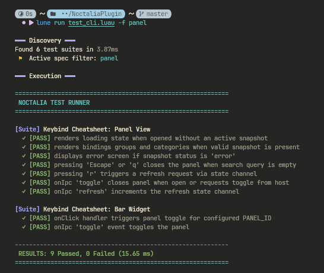
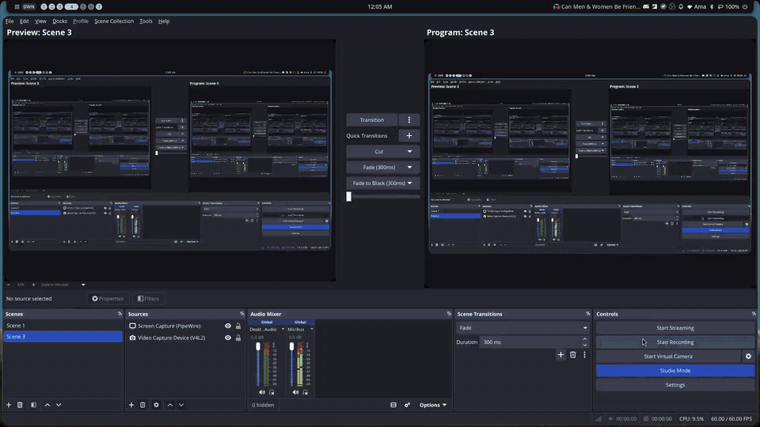
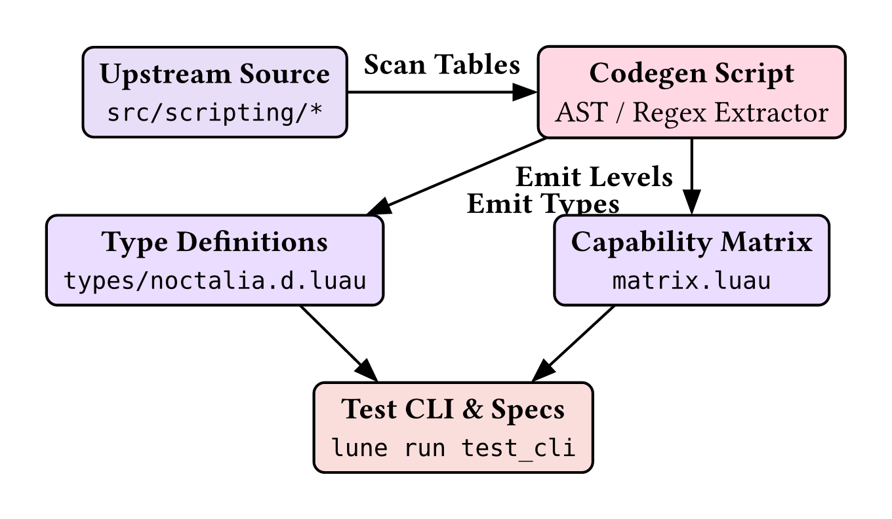

## Noctalia Plugin Suite & Luau Toolchain

My plugin collection, modular standard library (`STL`), and isolated test/LSP harness for the Noctalia Wayland shell.

### Overview

Noctalia provides a robust, isolated virtual environment for each plugin, exposing declarative lifecycle hooks such as `onIpc`.

This repository provides an integrated developer kit for Noctalia:

- **Standard Library (`STL`):** High-level, defensively designed wrappers for file operations, process management, serialization, and state tracking.
- **Headless Test Runner:** An out-of-shell testing environment built on Lune that mocks Noctalia host APIs and declarative UI side-effects.

- **Complete LSP Definitions:** Strict Luau typing definitions (`types/`) and toml schema verification for plugin manifests via `schema/`

### Included Plugins

#### [Keybind Cheatsheet](https://noctalia.dev/plugins/community/keybind-cheatsheet)

<p align="center">

<figure class="figure">

<p></p>

</figure>

</p>

The upstream plugin used a flat category layout, brittle module tracing via `require` regexes, and chunked progressive rendering to avoid engine timeouts. This refactor introduces hierarchical subsectioning, automated config discovery, and pre-computed view models over `STL`.

- Parses level-1 (`=`) and level-2 (`==`) config headings into structured `SECTION • SUBSECTION` headers, breaking dense keybind clusters into readable groups.
- Replaces manual module dependency tracing with a depth-capped crawler (`MAX_SCAN_DEPTH = 3`) that discovers all split config files while ignoring `.git`, `node_modules`, and cache directories.
- Key pills, formatted bindings, and lowercase search indices are generated during the service parse pass. Eliminating layout-time string transformations removes the need for progressive rendering workarounds entirely.
- Replaces runtime regex backtracking during `hyprctl binds -j` correlation with literal substring needle checks.
- Enforces `--!strict` across all modules, standardizes lifecycle hooks via `stl.lifecycle`, and prevents duplicate renders with atomic state signatures.

#### [Hypr Layout Switcher](https://noctalia.dev/plugins/community/hypr-layout-switcher)

<p align="center">

<figure class="figure">

<p></p>

</figure>

</p>



The upstream plugin tracked a single global layout string, causing multi-monitor setups to desync when different workspaces ran different layouts. It also lacked a picker UI and relied on coarse polling. This refactor introduces per-monitor tracking, an interactive picker panel, and zero-allocation state diffing over `STL`.

- Replaces the shared `"layout"` state key with a structured `hypr.topology` map. The background service queries both `monitors -j` and `workspaces -j`, ensuring each display’s bar widget reflects its own workspace layout rather than an arbitrary global state.
- Added a keyboard-driven modal panel (`[1-4]` shortcuts, `j`/`k` navigation, and quick apply) with badges and layout descriptions, replacing blind bar-click cycling.
- Clicking a specific bar widget passes `myOutput` via IPC (`cycle <monitor>`), altering only the targeted display’s active workspace instead of corrupting layout rules globally.
- Implements shallow structural validation (`isTopologyEqual`) to avoid triggering unnecessary redraws across isolated bar instances when polling unchanged compositor state.
- Replaces imperative `setText`/`setGlyph` calls with custom declarative layout pills (`UiFlexProps`) and migrates runtime hooks to `stl.lifecycle`.

### Noctalia Standard Library (`STL`)

The `STL` abstracts engine-level quirks, enforces defensive timeouts, and standardizes recurring operations across all plugins.

#### Codec `(lib/stl/codec.luau)`

Provides defensive serialization wrappers around the Noctalia host boundary with structured error containment.

- Validates engine serializer availability (`currentHost.json.decode`/`encode`) before calling them, eliminating runtime nil-indexing crashes during early startup or test mock initializations.
- Standardizes both `jsonDecode` and `jsonEncode` to return uniform `(result?, error?)` tuples instead of throwing unhandled runtime exceptions.
- Exposes static Luau typing across all parser endpoints, ensuring downstream modules handle decoding failures explicitly.

#### Config `(lib/stl/config.luau)`

Type-safe configuration reader with guaranteed defaults, defensive table cloning, and headless test host compatibility.

- Exposes dedicated typed accessors (`getString`, `getBool`, `getNumber`, `getStringList`, `getStringMap`) that validate the runtime shape from `currentHost.getConfig`, safely falling back if the value is absent or mismatched.
- Automatically shallow-clones returned tables (`getStringList`, `getStringMap`) using `table.clone`, preventing callers from mutating default structures or internal configuration tables in place.
- Guards against missing engine bridges gracefully, returning specified fallbacks when run outside the live shell (e.g., inside unit test environments).

#### Filesystem `(lib/stl/filesystem.luau)`

Defensive synchronous I/O operations, pure path manipulation, and isolated state persistence for plugins.

- Provides zero-I/O path arithmetic (`normalizePath`, `join`, `dirName`, `baseName`, `extension`), resolving relative segments (`.` and `..`), double-slashes, and trailing paths without touching the filesystem.
- Safely expands `$VAR`, `${VAR}`, `$HOME`, and `~` references across both live shell runtimes and Lune test environments.
- Wraps host primitives (`readText`, `writeText`, `fileInfo`, `listDir`) in uniform `(result?, error?)` return tuples. `writeText` automatically ensures parent directory creation via `mkdirAll`.
- Manages plugin-scoped configuration and cache payloads via `readPluginData` and `writePluginData`, abstracting engine storage paths with integrated JSON encoding and decoding.

#### Host `(lib/stl/host.luau)`

Boundary bridge resolving the ambient Noctalia host runtime and enabling seamless mock injection.

- Safely locates the engine host across global (`_G.noctalia`) and environment (`getfenv().noctalia`) tables without throwing reference errors when uninitialized.
- Provides `setInjectedHost` to intercept engine calls, allowing Lune test suites to supply synthetic host interfaces without monkey-patching runtime globals.
- Bridges directly with `types/noctalia.d.luau` via `typeof(noctalia)`, ensuring compile-time type safety across all STL host interactions.

#### Lifecycle `(lib/stl/lifecycle.luau)`

Declarative lifecycle hook registration with strict callback contracts and test unbinding utilities.

- Segregates lifecycle entry points into dedicated, strictly typed interfaces (`ServiceLifecycle`, `PanelLifecycle`, `WidgetLifecycle`), ensuring surfaces only implement relevant hooks (e.g., preventing widgets from binding panel-only events like `onFrameTick`).
- Injects lifecycle handlers into both the local chunk environment (`env[name]`) and the runtime global table (`_G[name]`) simultaneously, ensuring the host engine finds exported callbacks regardless of VM scoping conventions.
- Exposes `unbind` and `__getActiveHandlers` to strip registered hooks cleanly from `_G` and local environments, preventing handler leakage across Lune test suite runs.

#### Log `(lib/stl/log.luau)`

Structured diagnostic logger with component scoping, severity thresholds, JSON context serialization, and cross-VM replication.

- Generates tagged loggers via `log.scope("Tag")`, categorizing messages across disparate subsystems (`KeybindService`, `LayoutEngine`) with consistent prefixes.
- Supports `DEBUG`, `INFO`, `WARN`, `ERROR`, and `NONE` levels with dynamic threshold updates via `log.setLevel` and `log.syncFromConfig`.
- Automatically encodes optional `{ [string]: any }` context tables into structured JSON trailing strings using engine primitives or an internal recursive fallback.
- Dispatches log events both to host standard console outputs and an in-memory 100-entry ring buffer synchronized across VM boundaries via `currentHost.state.set("stl.logs.recent")`.

#### Proc `(lib/stl/proc.luau)`

Asynchronous subprocess execution, streaming outputs, fire-and-forget spawning, and binary availability memoization.

- Wraps `runAsync` into a typed `exec` helper with uniform `(err?, stdout, exitCode)` signatures, timeout handling (`res.timedOut`), and immediate error dispatch if the host task queue rejects the request.
- Provides configurable whitespace stripping (`trimOutput`, `maxTrimBytes`), automatically skipping regex pattern trimming on payloads exceeding 64 KiB to avoid exhausting the per-frame instruction budget on large JSON blobs.
- Exposes `spawn` for fire-and-forget external processes (such as CLI IPC triggers) and `stream` for persistent stdout line iteration (such as `playerctl --follow`).
- Implements an internal lookup cache (`PATH_CACHE`) for `commandExists` calls, preventing redundant `$PATH` directory scans during high-frequency service poll loops.

#### State `(lib/stl/state.luau)`

Type-safe pub/sub channel abstraction synchronizing shared state across isolated plugin surfaces.

- Exposes `state.channel<T>(key, defaultVal)` to construct strongly typed conduits (`StateChannel<T>`) encapsulating `get`, `set`, and `watch` workflows.
- Automatically returns a clone of the fallback default if the host state is uninitialized or explicitly set to `nil`, preventing external mutation of default state objects.
- Safely checks engine state capabilities (`currentHost.state.get`/`set`/`watch`) before execution, allowing state-dependent modules to run gracefully under test runners without runtime panics.
- Provides raw typed getters (`state.get<T>`) and setters (`state.set`) for ad-hoc key interaction without creating permanent channel handles.

### Development & Testing Workflow

Testing plugins directly inside a live Wayland compositor is slow, risks locking up your active desktop session, and creates an exhausting development loop: writing code, switching to browser docs to verify API availability, manually checking whether a function exists in the current runtime surface, and restarting the shell just to catch simple nil errors.

This repository uses [Lune](https://lune-org.github.io/docs/) alongside bundled type definitions (`types/*.d.luau`) to run test suites completely headless. Developers get instantaneous feedback on API contracts, type mismatches, and logic regressions directly from the terminal without touching a live compositor.

#### Architecture

<p align="center">
  
</p>

#### Mock the Host

Because Noctalia UI panels run in a restricted Luau VM, testing them in a live desktop session requires constantly toggling the compositor panel and parsing visual state manually. The testing harness (`lib/testing`) isolates the UI layer by stubbing Noctalia host primitives, mocking declarative UI containers (`ui`, `panel`), and simulating user input events.

##### How the Test Harness Works

The headless UI test suite runs on top of Lune without a running Wayland compositor:

- **Virtual Host Injection (`MockHost`):** `testing.bootstrap()` mounts a synthetic Noctalia host via `stl.host.setInjectedHost()`. Host queries like `focusedOutputName()`, `outputs()`, and `tr()` return deterministic test values, while external actions like `togglePanel()` are intercepted into test arrays.
- **Declarative Tree Capture (`MockPanel`):** Instead of emitting render buffers to a display server, `panel.render(node)` captures the root `UiNode` into `mockPanel.lastRendered`. Tests inspect the resulting table tree (checking properties like `rootNode.kind` and `rootNode.props.key`) to verify UI layout and visual state changes.
- **Lifecycle Hook Interception:** The panel chunk under test registers its event callbacks via `stl.lifecycle.panel(getfenv(), handlers)`. The test fixture intercepts this call, capturing references to `onOpen`, `onClose`, `onKey`, and `onIpc`.
- **Module Isolation:** To prevent cached closures and global environment bleed across test cases, `__clearModuleCache` purges the panel chunk, and `testing.teardown()` clears all registered lifecycle symbols in `afterEach`.

##### How to Write a UI Test

Writing a panel spec follows a four-step cycle: seeding the state, executing lifecycle hooks or user actions, asserting against the rendered node tree, and verifying cross-VM state channels.

###### 1. Seed State Channels

Populate any cross-VM state channels the panel reads during render passes:

```luau
local snapshotChannel = stl.state.channel(constants.SNAPSHOT_KEY, nil :: any)
snapshotChannel.set(getSampleSnapshot())
```

###### 2. Trigger Lifecycle Hooks

Simulate user or compositor events by invoking the captured lifecycle handlers:

```luau
if capturedHandlers.onOpen then
    capturedHandlers.onOpen(nil)
end
```

###### 3. Assert on the Rendered UI Node Tree

Verify layout hierarchy, conditional nodes, and element attributes directly on `mockPanel.lastRendered`:

```luau
local rootNode = mockPanel.lastRendered
testing.assert.truthy(rootNode ~= nil, "Panel did not render a UI tree")
testing.assert.equal(rootNode.kind, "column")
testing.assert.equal(rootNode.props.key, "keybind-cheatsheet-bindings")
```

###### 4. Validate Input Handling & Side Effects

Invoke `onKey` or `onIpc` to confirm modal dismissals, quick-actions, or state requests:

```luau
-- Test keybind dispatch
capturedHandlers.onKey("r", true)

local refreshChannel = stl.state.channel(constants.REFRESH_REQUEST_KEY, 0)
testing.assert.equal(refreshChannel.get(), 1)

-- Test panel dismissal
capturedHandlers.onKey("Escape", true)
testing.assert.truthy(mockPanel.wasClosed, "Panel did not close on Escape")
```

See more examples in the [keybind-cheatsheet test repository](https://github.com/Markism-JA/NoctaliaPlugin/tree/master/plugin/keybind-cheatsheet/tests).

##### Test Runner Setup & Environment

Refer to the [official Lune installation guide](https://lune-org.github.io/docs/getting-started/1-installation/) to install the binary for your platform.

###### Generating Type Definitions & `.luaurc`

Once Lune is installed, run the setup command from the repository root:

```bash
lune setup
```

Running `lune setup` performs two environment tasks:

1. **Downloads Typedefs:** Extracts Luau type definitions for all built-in Lune modules (`@lune/fs`, `@lune/process`, `@lune/stdio`, `@lune/luau`, etc.) into `~/.lune/.typedefs/<version>/`.
2. **Configures `.luaurc`:** Adds or updates the `aliases` table in the local `.luaurc` file to map `@lune/` imports to those definitions:

```json
{
  "aliases": {
    "lune": "~/.lune/.typedefs/x.y.z",
    "@lune/": "~/.lune/.typedefs/x.y.z/"
  }
}
```

This configuration enables `luau-lsp` and `luau-analyze` to resolve module types such as `require("@lune/fs")` without raising unresolved import warnings.

##### How to Use the Test CLI



The test runner (`test_cli.luau`) automates spec discovery, isolates module execution, and provides diagnostic filtering.

###### Spec Naming Convention & Discovery

For a test file to be picked up by the runner during directory scanning, it _must_ end with the `_spec.luau` suffix:

- Accepted: `panel_spec.luau`, `proc_spec.luau`, `types_spec.luau`
- Ignored: `panel_test.luau`, `spec.luau`, `testing.luau`, `tests.luau`

The discovery engine recursively traverses the repository and automatically ignores standard dependency, metadata, and build trees (`.git`, `.luau`, `.github`, `node_modules`, `dist`, `build`, and `types`).

###### Execution Commands

Run the full suite or target specific subsets:

```bash
# Execute all discovered specs (*_spec.luau) across the project
lune run test_cli

# Run a specific spec file or plugin directory
lune run test_cli plugin/keybind-cheatsheet
lune run test_cli tests/specs/proc_spec.luau

# Filter tests by suite or test case title
lune run test_cli -- -f "renders loading state"

# Abort immediately on the first encountered failure
lune run test_cli -- -x

# Silence engine errors and print only assertion results
lune run test_cli -- -q
```

###### CLI Flags Reference

| **Flag** | **Description** |
| --- | --- |
| `-f, --filter <str>` | Filters suites and test descriptions matching the given substring. |
| `-x, --fail-fast` | Halts the test runner immediately on the first assertion failure. |
| `-q, --quiet` | Suppresses noisy error traces emitted by external processes during testing. |
| `-h, --help` | Prints the usage banner and flag reference. |
| `[path ...]` | Limits discovery to matching file paths, directories, or module names. |

### Editor & Tooling Setup

This repository relies on strict type inference and automated schema validation. The reference configuration is implemented with _Neovim (LazyVim)_, but the underlying mechanisms translate directly to other editors like `VS Code` or `Helix`.

Reference configurations:

- Luau & Type Bundler: [lua/plugins/luau.lua](https://github.com/Markism-JA/nvim/blob/master/lua/plugins/luau.lua)
- TOML Manifest Validation: [lua/plugins/toml.lua](https://github.com/Markism-JA/nvim/blob/master/lua/plugins/toml.lua)

#### Luau LSP & Ambient Type Injection



Luau does not natively auto-load multiple sibling definition files located inside a directory unless they are explicitly referenced or mapped.

##### How the Neovim Pipeline Works

The Neovim integration leverages `lopi-py/luau-lsp.nvim` and automates type bundling before initializing the language server:

1. **Root Discovery:** Traverses upward from the current working directory to locate `.luaurc`, `.taplo.toml`, or `.git` to establish the project root.
2. **Dynamic Definition Bundling (`types/.all.d.luau`):**
   - Scans the `types/` directory for all files matching `*.d.luau` (excluding any existing `.all.d.luau`).
   - Strips individual file mode pragma headers (e.g., `--!nocheck` or `--!strict`) to avoid compiler directive conflicts.
   - Concatenates the definitions into a single bundle file at `types/.all.d.luau` prefixed with `--!strict`.
3. **Global Alias Mapping:** Registers the generated bundle file under the root alias `["@"]` inside the LSP `definition_files` configuration. This exposes all ambient types (such as host globals, Noctalia APIs, and Lune primitives) across every project file without manual imports.
4. **Modern Type Solver:** Enables `fflags.enable_new_solver = true` to run Luau’s updated type checker.

#### Manifest Validation (Taplo TOML)

Plugin configurations and metadata files (`manifest.toml`) are validated using `taplo`, a language server for TOML files that resolves JSON/TOML schemas.

Schema Enforcement:

- With `evenBetterToml.schema.enabled = true`, Taplo resolves the schema directive defined at the root or within project settings.
- Hover Docs & Autocompletion: Provides direct autocomplete and schema validation against Noctalia’s plugin specifications, flagging missing fields or incorrect types at edit time.

### Maintenance & Upstream Synchronization

Keeping the STL compatibility matrix and ambient type definitions synchronized with Noctalia core updates requires bridging upstream C++ host bindings with downstream Luau type contracts. Upstream compatibility can be maintained through two complementary workflows: _manual release tracking_ aligned with the official capability matrix documentation, or _automated AST/regex extraction_ directly from the engine source tree.

#### Release-Driven vs. Source-Driven Workflows

Depending on the development context, synchronization follows one of two paths:

**1. Manual Release Tracking (Documentation & Tags)**

- Monitor official Noctalia release milestones (e.g., `v5.0.0-beta.3` through `v5.0.0-beta.9`).
- Audit the public plugin API capability documentation when upstream introduces an API level increment (levels 3 through 28+).
- Append new feature entries to `matrix.luau` (`FeatureKey`, level number, minimum Noctalia version, and bound runtime symbol).
- Update the ambient type declarations in `types/noctalia.d.luau` to expose new signatures, config options, and `@since API <level>` docstrings.

**2. Automated Engine Source Codegen (`src/scripting/`)**

- Run an automated extraction task targeting a local clone or Git submodule of the `noctalia-dev/noctalia` repository.
- Parse C++ binding registrations across `luau_host.cc` and `plugin_bindings.cc` to discover newly registered symbols directly from source.
- Extract argument assertions (`luaL_check*`, `lua_to*`) and structural schemas (`UiTreeValue`, `HttpRequest`, `ContextMenuRequest`) to generate updated `types/noctalia.d.luau` definitions and cross-verify `matrix.luau`.

#### Capability Matrix vs. Engine Source Mapping

The compatibility matrix (`matrix.luau`) reflects bindings defined across three primary C++ subsystems in `src/scripting/`:

- **Core Host Primitives (`luau_host.cc`):** Exposes the global `noctalia` table via `kNoctaliaBaseLib` (`runAsync`, `systemStats`, `readFileAsync`, `openSettings`, `diskMounts`, etc.), alongside nested libraries:
  - `noctalia.state` via `kNoctaliaStateLib` (`get`, `set`, `watch`)
  - `noctalia.sound` via `kNoctaliaSoundLib` (`load`, `play`)
  - `noctalia.json` via `kNoctaliaJsonLib` (`encode`, `decode`)
  - `noctalia.string` via `kNoctaliaStringLib` (`trim`, `urlEncode`, `urlDecode`)
- **Declarative UI & Contextual APIs (`plugin_bindings.cc`):** Injects surface-specific globals into plugin environments:
  - `panel` via `kPanelLib` (`render`, `close`, `openContextMenu`, `setNeedsFrameTick`)
  - `barWidget` via `kWidgetLib` (`setText`, `setGlyph`, `setImage`, `setTooltip`, `render`)
  - `desktopWidget` via `kDesktopWidgetLib` (`render`, `setWantsSecondTicks`, `setNeedsFrameTick`)
  - `launcher` via `kLauncherLib` (`setResults`, `setQuery`)
  - `shortcut` via `kShortcutLib` (`setLabel`, `setIcon`, `setActive`, `setEnabled`)
  - `ui` virtual nodes via `readUiTreeNode` (`column`, `row`, `scroll`, `input`, `dragSource`, etc.)
- **Catalog & Version Gatekeeping (`plugin_catalog.cc`):** Enforces `supportsPluginApiVersion()` and evaluates `plugin_api` fields in `plugin.toml` manifests, dictating fallback compatibility and release resolution.

#### Automated Extraction Pipeline

When utilizing the automated pipeline, the codegen script parses binding tables to produce ambient type declarations and matrix stubs:

<p align="center">
  
</p>

##### Extraction Mechanics

1. **Symbol Discovery via LuaL Registrations:** The extractor scans `kNoctaliaBaseLib`, `kWidgetLib`, `kPanelLib`, and nested module arrays in `luau_host.cc` and `plugin_bindings.cc`:

   ```regex
      \{"([a-zA-Z0-9_]+)",\s*(luau_[a-zA-Z0-9_]+)\}
   ```

Every matched registration identifies a function exposed on host global surfaces.

1. **Signature and Type Inference:**

The parser inspects the body of each matched C++ handler function, inferring the corresponding Luau type signature based on argument extraction patterns:

- `luaL_checknumber` / `lua_tonumber`  `number`
- `luaL_checklstring` / `lua_tolstring`  `string`
- `lua_toboolean`  `boolean`
- `luaL_checktype(..., LUA_TFUNCTION)`  `(...any) -> (...any)`
- `luaToJson` / `jsonToLua`  `any` (JSON-serializable table/primitive)
- `readUiTreeNode` / `luau_ui_render`  `UiNode`
- Structured table readers (`httpRequestFromTable`, `tooltipRowFromLuaTable`)  Luau record types (`HttpRequest`, `ScriptTooltipRowPatch`)

1. **Level Verification via Release Diffs:**

When analyzing new upstream releases, Git diffs against `src/scripting/` isolate newly introduced binding functions, linking each new addition to the active release milestone to populate `level`, `feature`, and `noctaliaVersion` entries in `matrix.luau`.

#### Generated Typings and Environment Bundling

Generated definitions in `types/noctalia.d.luau` are structured into four core contract layers:

- **Host Primitives (`declare noctalia: Noctalia`):** Declares low-level shell integrations, including `runAsync`, `readFileAsync`, hardware sensor probes (`systemStats`, `cpuCores`, `diskStats`), and inter-VM channels (`noctalia.state`).
- **Surface Controllers (`panel`, `barWidget`, `desktopWidget`, `shortcut`, `launcher`):** Defines ambient control handles exposed to specific plugin entrypoints.
- **Declarative UI Hierarchy (`declare ui: Ui`):** Declares virtual UI tree builders (`column`, `row`, `scroll`, `button`, `input`, `dragSource`, `dropZone`).
- **Automated Bundling:** During Neovim startup, the Luau LSP integration scans `types/*.d.luau` and concatenates all files into `types/.all.d.luau`, exposing engine typedefs alongside plugin-specific types without manual imports.

#### Running Upstream Sync

Run the sync task against a local engine source checkout:

```bash
# Extract and update types/matrix from local engine source
lune run scripts/sync_upstream --path=../noctalia

# Validate updated types and matrix against the spec suite
lune run test_cli
```

### Runtime Limitations & Guardrails in Practice

To prevent misbehaving plugins from freezing the Wayland compositor or degrading frame delivery, the Noctalia host enforces strict runtime constraints on CPU consumption, memory allocation, and I/O execution.

#### 1. Active Thread CPU Metering (`CLOCK_THREAD_CPUTIME_ID`)

The engine meters plugin callbacks using actual thread CPU cycles via `CLOCK_THREAD_CPUTIME_ID` rather than wall-clock time:

- **Descheduling Immunity:** If the operating system deschedules the worker thread due to background system load, the elapsed wall time does not consume the script budget. Only active execution cycles count against the allocated threshold (typically 25 ms for general callbacks, 100 ms for initial chunk evaluation).
- **Inter-Instruction Watchdog:** Luau hooks into an execution interrupt callback (`lua_callbacks(L)->interrupt = budgetInterrupt`). The watchdog checks thread CPU time between VM instructions and aborts execution via `luaL_error` when the deadline is crossed.
- **Syscall Blind Spot:** Because interrupts only fire between Luau bytecode instructions, a blocking kernel syscall initiated inside a C binding cannot be preempted mid-call. If a binding takes 30 ms inside a kernel read, the engine records that specific binding via `BudgetCrossingScope` and raises a budget-exceeded failure immediately upon return.
- **Practical Mitigation:** Large workloads—such as decoding monolithic JSON trees (e.g., `hyprctl binds -j`) or iterating over thousands of search candidates—must never run in a single synchronous pass. Defer processing across ticks using `stl.lifecycle`, offload payload filtering to sub-processes, or tokenize payloads incrementally.

#### 2. The Watchdog Circuit Breaker & Lifecycle Ejection

A script failure on a recurring tick degrades compositor stability if left unchecked:

- **Failure Deduplication:** The host tracks error frequency by callback name and error message inside a sliding 60-second window (`kCallFailureLogWindow`). Identical errors are suppressed to prevent log-pipe exhaustion, emitting aggregate summary counters instead.
- **Circuit Breaker Unmounting:** If a plugin repeatedly exceeds its CPU deadline or throws unhandled memory errors across consecutive ticks, the host trips an internal circuit breaker. The engine halts the plugin lifecycle, unmounts its registered UI trees, clears active state channel watches, and disables the instance until a manual shell restart or manifest reload.
- **Memory Ceiling Boundary:** Each plugin VM operates under a hard heap ceiling (128 MiB) enforced via a custom `lua_Alloc` allocator. Reaching this boundary triggers a catchable `LUA_ERRMEM` rather than taking down the core desktop process via the system OOM killer.
- **Defensive Practice:** Wrap risky decoders in protected evaluations (`pcall`), handle nil/error returns from host queries defensively, and discard stale calculation frames if new inputs arrive before processing completes.

#### 3. Synchronous Disk I/O vs. Background Task Pools

The host filesystem bindings expose both synchronous and asynchronous execution paths with distinct trade-offs:

- **Main Thread Stalls:** Calls to `noctalia.readFile()`, `noctalia.fileInfo()`, `noctalia.listDir()`, and `noctalia.mkdirAll()` execute synchronously on the runtime worker thread. While functional for tiny configuration files, accessing rotational disks, slow network mounts, or large asset directories blocks subsequent plugin updates and risks exceeding the execution budget.
- **Dedicated Asynchronous I/O Pool:** The host maintains a bounded async I/O pool (`ScriptIoPool`) dedicated to off-thread operations:
  - `noctalia.readFileAsync(path, cb)` queues reads into worker threads, enforcing a 4 MiB buffer ceiling per request and a concurrency cap (maximum 4 concurrent reads per host).
  - `noctalia.runAsync(cmd, cb)` offloads command execution to detached subprocess workers, capturing standard output up to 1 MiB while enforcing timeout bounds (clamped between 50 ms and 60 seconds).
- **Practical Rule of Thumb:** Never read dynamic cache files, large log streams, or media assets using synchronous APIs. Use `noctalia.readFileAsync()` for arbitrary file access, `noctalia.sound.load()` for sound samples, and argument-array `runAsync({"cat", path}, cb)` for streaming data.

### Acknowledgments

Noctalia’s decision to use isolated Luau VMs provides a remarkably solid foundation for Wayland desktop components. This aims to complement that architecture with modern testing patterns, rigorous types, and resilient utilities for developer experience.
